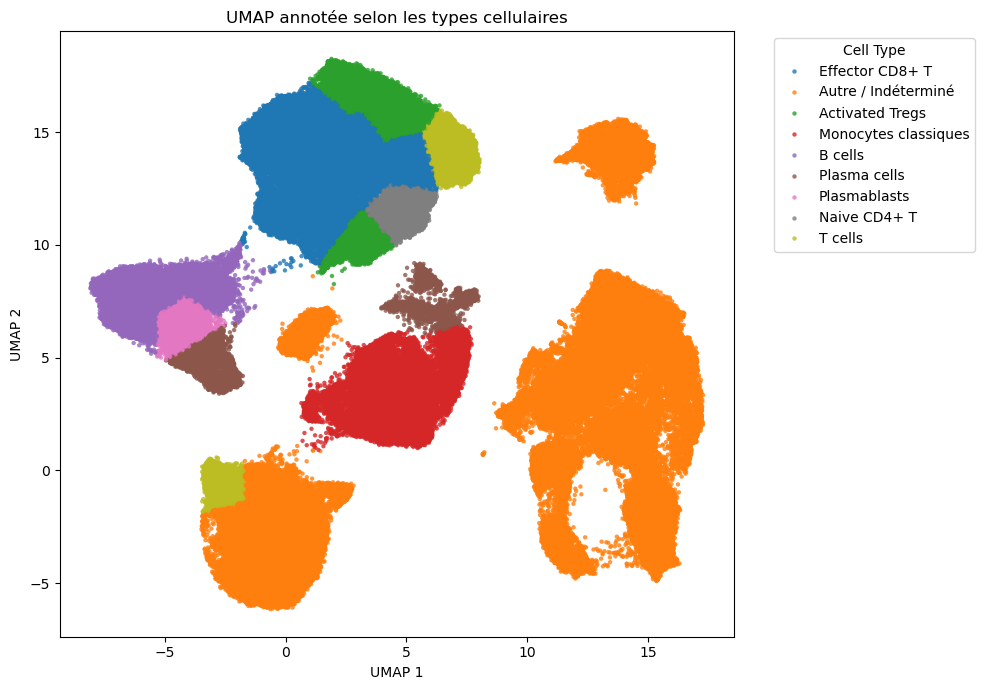
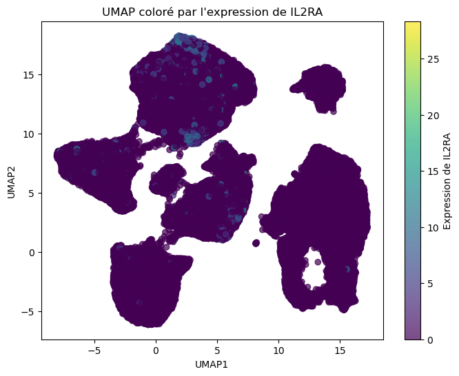
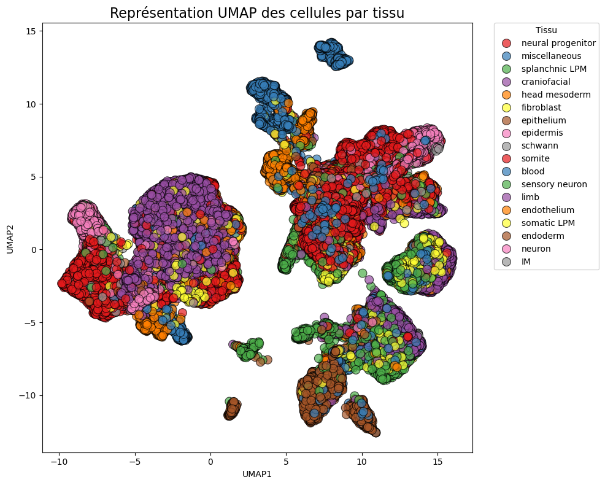
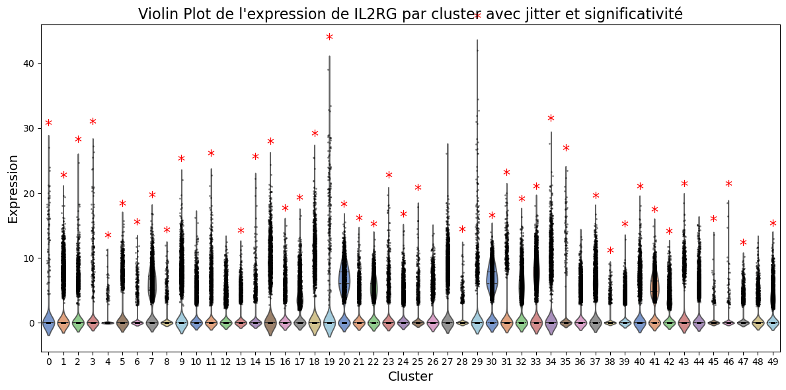

<div align="center">

# IL-2 Receptor Mapping with Single-Cell RNA-seq

**Where are the three chains of the interleukin-2 receptor expressed? A single-cell RNA-seq analysis of human embryonic and tumour tissue.**




*Automatically annotated cell types in a colorectal cancer sample (371k cells).*

</div>

---

## About

Interleukin-2 (IL-2) is a key cytokine for T lymphocytes. Depending on the receptor it binds, it can boost **effector T cells** or sustain **regulatory T cells (Tregs)**. That balance matters for autoimmune diseases and immunotherapy. The receptor is made of three subunits:

| Gene | Chain | Known role |
|---|---|---|
| **IL2RA** (CD25) | α | High-affinity receptor, Treg / activation marker |
| **IL2RB** (CD122) | β | Signalling chain, enriched in cytotoxic cells |
| **IL2RG** (CD132) | γ | Common chain shared by several cytokine receptors |

This project maps the expression of these three genes, cell by cell, using public single-cell RNA-seq datasets. It was the final-year group project of the **Data Science & AI minor** (L3, course LU3DS004, May 2025). This repository contains **my part of the analysis**, covering two of the group's four datasets:

| Dataset | Cells | Genes | Source |
|---|---|---|---|
| Human early embryogenesis | 185,140 | 32,351 | GEO [GSE157329](https://www.ncbi.nlm.nih.gov/geo/query/acc.cgi?acc=GSE157329) |
| Colorectal cancer immune hubs | 371,223 | 43,282 | Single Cell Portal [SCP1162](https://singlecell.broadinstitute.org/single_cell/study/SCP1162) |

## Pipeline

```
Raw counts ─► QC & filtering ─► Normalization ─► Truncated SVD ─► UMAP ─► K-Means ─► Marker-based annotation ─► Statistical tests
```

1. **Quality control.** Keep cells with 200 to 2,000 detected genes and less than 10% mitochondrial reads (removes empty droplets, doublets and dying cells).
2. **Normalization.** Library-size normalization to 10,000 counts per cell.
3. **Dimensionality reduction.** `log1p` transform, then Truncated SVD (20 components, suited to sparse matrices), then a 2D UMAP.
4. **Clustering.** K-Means on the UMAP embedding (50 clusters).
5. **Automatic annotation.** Each cluster is labelled with rule-based logic on canonical markers, such as `FOXP3 + IL2RA + TNFRSF4` for activated Tregs, `CD3E + CD8A + PRF1 + GZMB` for effector CD8⁺ T cells, `CD19 + MS4A1` for B cells and `CD14` for monocytes.
6. **Differential expression.** Student's t-test and Mann-Whitney U test comparing each cluster with all others, shown as violin plots annotated with significance stars.

All steps are implemented as reusable functions in [`src/bibli_immuno_ia.py`](src/bibli_immuno_ia.py), the analysis library shared by the project group.

## Key findings

<p align="center">
  
  
</p>

- **Colorectal cancer.** IL2RA is concentrated in clusters annotated as **Tregs**, consistent with local immunosuppression in the tumour. IL2RB marks **activated CD8⁺ T cells**, revealing an active cytotoxic compartment alongside it.
- **Embryogenesis.** Expression is weaker and more diffuse. IL2RA is significant in two clusters, possibly early myeloid cells, which suggests that pieces of the IL-2 pathway are already in place during early development.
- **IL2RG** is broadly expressed in both datasets, as expected for a chain shared by several cytokine receptors.

<p align="center">
  
</p>

The full analysis and discussion, covering all four datasets of the group project, are in the [project report (in French)](docs/report_IL2R_scRNAseq.pdf).

## Repository structure

```
.
├── notebooks/
│   ├── 01_embryogenesis.ipynb       # Embryo dataset (+ analysis by developmental system)
│   └── 02_colorectal_cancer.ipynb   # Colorectal cancer dataset
├── src/
│   └── bibli_immuno_ia.py           # Shared pipeline functions (QC, SVD, UMAP, clustering, annotation, stats, plots)
├── figures/                         # Key figures used in this README
├── data/                            # Not versioned: see data/README.md
└── docs/
    └── report_IL2R_scRNAseq.pdf     # Full project report (French)
```

## Getting started

```bash
git clone https://github.com/Eve-Ast/il2r-scrnaseq.git
cd il2r-scrnaseq
pip install -r requirements.txt
```

1. Download the datasets as described in [`data/README.md`](data/README.md).
2. Launch Jupyter and open a notebook from `notebooks/`.

> ⚠️ These datasets are large: loading the colorectal matrix requires a machine with plenty of RAM.

## Team

Group project by **Eve-Angeline Stephen**, Isabella Raevel and Anaïs Storp, supervised by Sarah Ouadah and Raphaël Fournier-S'niehotta.
The code in this repository covers the datasets I analysed. My teammates worked on the kidney and multi-tissue immune datasets.

## References

- Pelka K. *et al.* (2021). *Spatially organized multicellular immune hubs in human colorectal cancer.* Cell 184(18):4734–4752.
- Luecken M.D. & Theis F.J. (2019). *Current best practices in single-cell RNA-seq analysis: a tutorial.* Mol. Syst. Biol. 15:e8746.
- McInnes L., Healy J. & Melville J. (2018). *UMAP: Uniform Manifold Approximation and Projection for dimension reduction.* arXiv:1802.03426.
- Zhang X. *et al.* (2019). *CellMarker: a manually curated resource of cell markers in human and mouse.* Nucleic Acids Res. 47:D721–D728.
